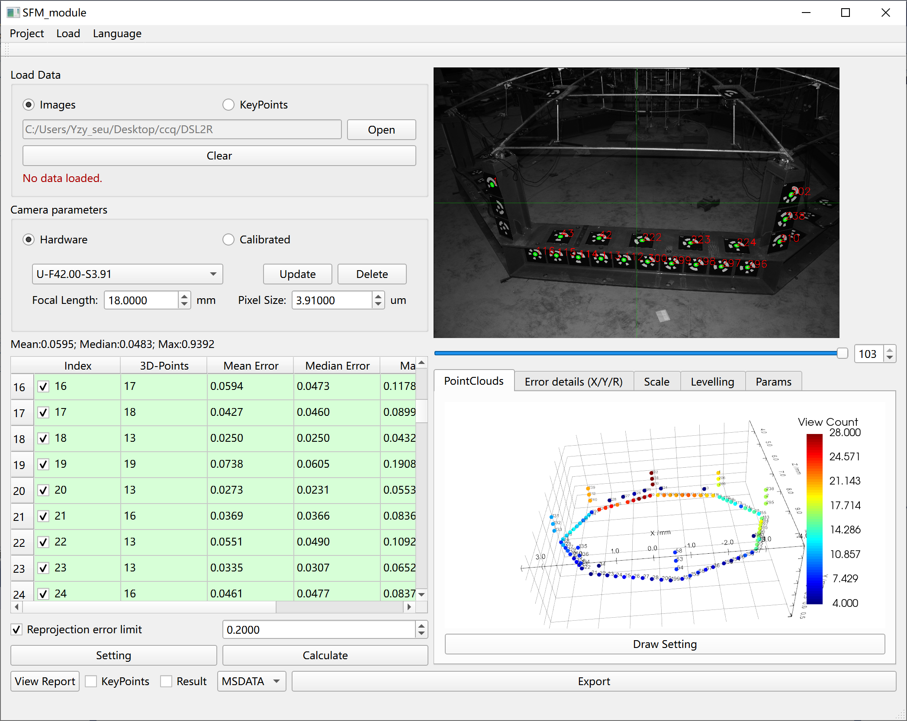
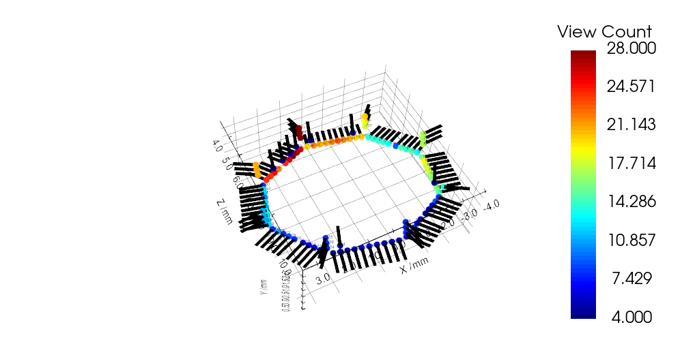

# SFM-from-Circular-Coded-Target-module
The original purpose of SFM-from-Circular-Coded-Target-module(SFM-CCT)  Library was to serve **Photomechanics** methods such as Muti-camera Digital Image Correlation (DIC) [1] and Fringe Projection.  
SFM-CCT library can be used for structure from motion from CCT images. It mainly includes the following functions:  
1. Identification CCT features. 
2. Optimization of 3D points and  RT.  
  
3. Estimating the normal direction of a circle and compensating for perspective errors [2].   
  
4. Output corner data and reconstruct results (*.csv/*.mat/*.txt/*.msdata).The format of the msdata file has been defined in Format_Document.h.
  
  
Dependency library:  
1. Ceres  
2. Opencv  
3. Matlab (only for *.MAT file output supported)
  
Researchers interested in these can follow the authors YIN,ZHUOYI(Southeast University) in Google Scholar.

[1] Yuan F, Ren X, Pan R, et al. Tensile Construction Monitoring and Progressive Collapse Test of Suspen-Dome Structure Based on UAV-Assisted Close-Range Photogrammetry and Multi-Camera Stereo-Digital Image Correlation[J]. Experimental Mechanics, 2023, 63(8): 1371-1389.  
[2] It will be replaced with an arvix link within a week.

